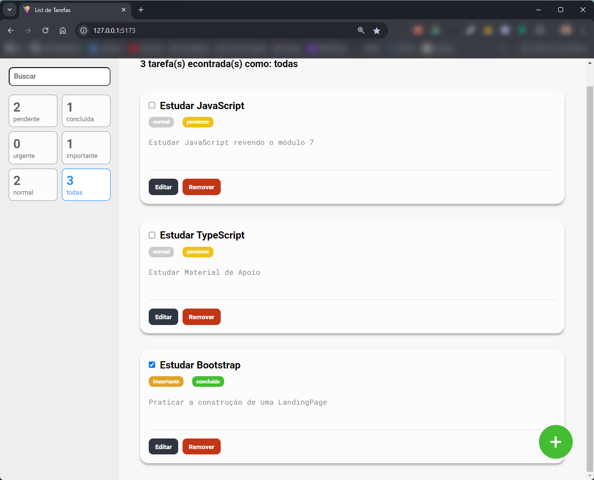
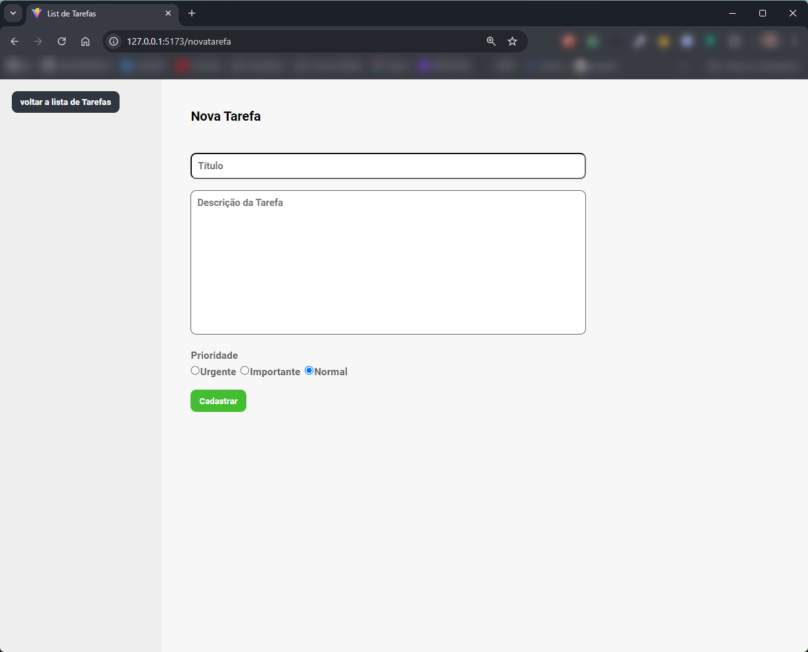

<!-- Banner de Apresentação -->


<br>
<br>

<!-- Titulo do Projeto -->

# ✨To-Do List


## Table of Contents

- [Project description](#project-description)
- [Setup](#setup)
  - [Prerequisites](#prerequisites)
  - [technologies and tools](#technologies-and-tools)
- [Instalation](#instalation)
- [Usage](#usage)
- [References](#references)
- [Contributors or owners](#contributors-or-owners)
  - [Contribute-to-the-projects](#contribute-to-the-projects)
- [Contact](#contact)
- [License](#license)

## Project Description

Esse Projeto é uma Lista de tarefas minimalista, onde podemos incluir nossas tarefas de forma simples e prática. Ele foi construido para a prática com Typescript e redux@toolkit

`Task`

- Desenvolver o Projeto e melhorar o aprendizado com `TypeScript` e `redux@toolkit`

`Charlenge`

- Criar funcionalides com o **redux@toolit** como:
- Funcionalidades:
  - criar uma nova tarefa.
  - Alteraçào da Tarefa.
  - remoçào de tarefa.
  - filtar uma nova tarefa pela sua descriçào ou categoria.
  - criar uma rota para uma página de criação da tarefa com @react-router-dom

> [!Tip]
> Caso queira ver como ficou siga os passos abaixo.

<!-- Menu -->

<!-- Setup do Projeto -->

## Setup

Requisitos necessários para rodar o projeto:<br>

### Prerequisites

`Node.js` `VSCode` `Git` `Live Server`

> [!Important]
>
> - Run Time [Node.js](https://nodejs.org/en/) com a versão _16 ou superior_.<br>
> - Um editor de códigos onde eu recomendo o [VCode](https://code.visualstudio.com/)<br>
> - E o [git](https://git-scm.com/downloads) uma aplicação de versionamento de código.
> - Extensão do VSCode [**Live Server**](https://marketplace.visualstudio.com/items?itemName=ritwickdey.LiveServer)

### technologies and tools

`React.js` `TypeScript` `redux` `redux@toolkit` `styled-components` `react-router-dom` `esLint`

## Instalation

Para rodar o projeto em seu computador você tera que fazer o [fork](https://docs.github.com/pt/pull-requests/collaborating-with-pull-requests/working-with-forks/fork-a-repo) do repositório.Estou deixando um **link** da documentação oficial do gitHub, onde é esclarecido como fazer essse processo.<br> Fazendo esse processo você tera uma copia desse Repositório no seu GitHub.
<br>

<a href="https://docs.github.com/pt/pull-requests/collaborating-with-pull-requests/working-with-forks/fork-a-repo"></a>

Depois de ter feito o **fork** vamos fazer o [clone](https://docs.github.com/pt/repositories/creating-and-managing-repositories/cloning-a-repository) desse Repositório atráves do **VSCode**. </br>
Estou deixando um link para a documentação oficial do gitHub onde é esclarecido como fazer essse processo.
<br>
<sub>Command Line</sub>

```bash
git clone https://github.com/emmanuelmarcosdeoliveira/contac-list
```


<a href="https://docs.github.com/pt/repositories/creating-and-managing-repositories/cloning-a-repository"></a>

Dentro do nosso **VSCode** vamos abrir o nosso **terminal**. Temos que baixar as dependências do Projeto para o nosso computador para que ele consiga ser Executado:

**1. Instalando as dependências**<br>

 <details open>

<summary>Gerenciador de pacotes usado</summary>

**npm**

</sdetais>

<sub>Command Line</sub>

```npm
npm install
```

<br>

## Usage

**2. Inicie o processo de desenvolvimento onde o projeto é aberto em um navegador digitando os comandos abaixo no nabegador**<br>
<sub>Command Line</sub>

```npm
npm run dev
```

<br>

 <!-- Imagem de Demostração -->
<h3 align="center"> Imagem de demostração do Projeto

</br>
</br>


</br>
</br>



<!-- <h3 align="center">📽️project demonstration video</h3>
<br>
<p align="center">Video de Demostraçào</p> -->

<br>
 <div align="center">
Acesse a versão on-line Projeto clicando no Link Abaixo
<br>
<br>
<a href="https://to-do-vue-xi-pink.vercel.app/">
</a>

</div>
<br>

## References

**Acesse:** [EBAC](https://ebaconline.com.br)

## Contributors or owners

|                                     owner                                     |
| :---------------------------------------------------------------------------: |
|  |
|                               Emmanuel Oliveira                               |

Designed by EBAC and developed by [Emmanuel Oliveira](https://www.linkedin.com/feed/?trk=homepage-basic_sign-in-submit)<br>
&copy; Todos os Direitos Reservados

### Contribute to the projects

<details>
<summary>Como fazer uma contribuição ao Projeto ?</summary>
- Familiarize-se com a documentação do projeto, que geralmente inclui guias de instalação.<br>
- Explore o código do projeto para entender sua estrutura e funcionamento.<br>

**Faça um Fork**

- Crie uma cópia (fork) do repositório original em sua conta do GitHub.<br>
  Isso permitirá que você faça alterações sem afetar o projeto original.<br>


<a href="https://docs.github.com/pt/pull-requests/collaborating-with-pull-requests/working-with-forks/fork-a-repo"></a>

**Clone o Repositório**

Isso criará uma cópia local do projeto, onde você poderá fazer suas modificações.


<a href="https://docs.github.com/pt/repositories/creating-and-managing-repositories/cloning-a-repository"></a>

**Crie uma Nova Branch:**

- Crie uma nova branch para isolar suas alterações.<br>
- Isso facilita a organização do seu trabalho e a criação de pull requests.<br>

**Faça as Alterações:**

- Crie funcionalidades, mude estilos ou resolva `bugs` que iram contribuir para a melhoria do Projeto.<br>

**Crie um Pull Request:**

- Inclua uma descrição clara das suas alterações e explique como elas resolvem o problema ou melhoram o projeto.<br>
- Solicitação: Envie um pull request para o repositório original, solicitando que suas alterações sejam incorporadas ao projeto.
  <br>

**Revise e Responda a Feedback:**

- Colabore: Os mantenedores do projeto podem solicitar alterações ou fornecer feedback sobre o seu código.

</details>

## Contact

<a href ="https://wa.me/5511968336094"></a>
<a href = "mailto:oliveira.devfullstack@gmail.com"></a>
<a href="https://www.linkedin.com/in/oliveira-marcos-emmanuel?lipi=urn%3Ali%3Apage%3Ad_flagship3_profile_view_base_contact_details%3BUetG4s3ZT76Byt3XWdZ2Tg%3D%3D" target="_blank"></a><br>
<sub>😁Obrigado por chegar até aqui!<sub>

## License

<br>
Released in 2024 This project is under the **MIT license**<br>
<br>
<br>

[`voltar ao topo`](#to-do-list)
